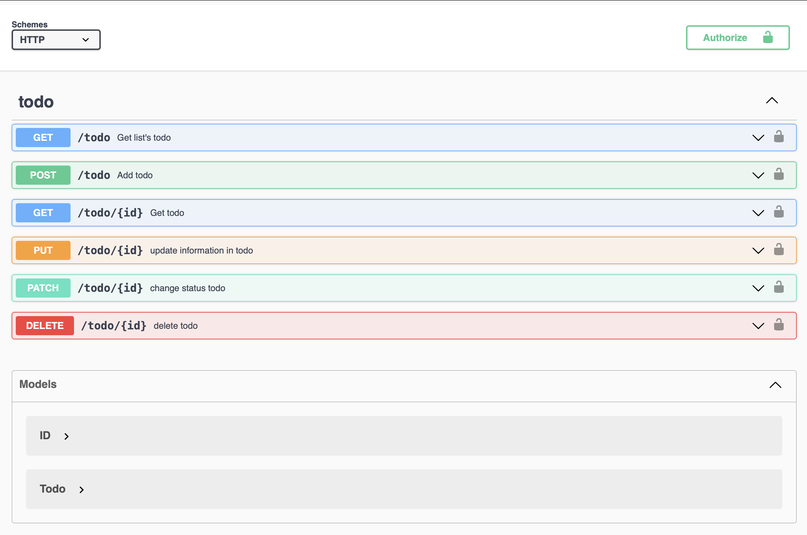

# todo-express
- api document (http://localhost:3000/swagger/)

## API LIST TABLE
| TYPE | PATH |
|:--:|:--|
| GET 	| todo |
| POST 	| todo |
| GET 	| todo/:id |
| PUT 	| todo/:id |
| PATCH 	| todo/:id |
| DELETE 	| todo/:id |
